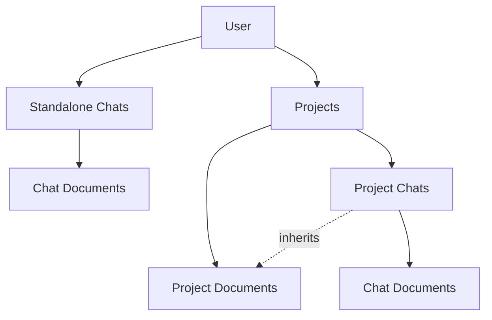

# Enhanced Chat and Document Architecture

## Architecture Overview



**Like ChatGPT/Claude:**

- **Standalone Chats**: Quick conversations with chat-specific docs
- **Projects**: Organized workspaces with shared knowledge base
- **Project Chats**: Inherit project docs + can have chat-specific docs

---

## User Review Required

> [!IMPORTANT]
> Key decisions:
>
> 1. Standalone chats vs Project chats (docs scoped accordingly)
> 2. Project docs shared, chat docs private
> 3. User authentication deferred (single-user for now)

---

## Data Models

```python
class Chat(BaseModel):
    id: str                    # chat_xxx
    project_id: str | None     # None = standalone chat
    title: str
    is_pinned: bool = False
    created_at: datetime

class Project(BaseModel):
    id: str                    # proj_xxx
    name: str
    created_at: datetime

class Document(BaseModel):
    id: str                    # doc_xxx
    filename: str
    scope_type: "chat" | "project"
    scope_id: str              # chat_id or project_id
    chunk_count: int
    uploaded_at: datetime
```

---

## Security Considerations

| Concern        | Mitigation                         |
| -------------- | ---------------------------------- |
| Doc isolation  | Query filter enforces scope        |
| Path traversal | Pydantic validation on upload      |
| File type      | Strict `.pdf` check                |
| Injection      | Parameterized MongoDB queries      |
| Future: Auth   | JWT tokens + user_id on all models |

---

## Scalability

| Component    | Strategy                               |
| ------------ | -------------------------------------- |
| Vector DB    | MongoDB Atlas scales horizontally      |
| Embeddings   | Async via Inngest + rate limiting      |
| File storage | Local (dev) → S3 (prod) via config     |
| API          | Stateless FastAPI → horizontal scaling |

> [!TIP]
> S3 migration is ~30 lines of code change. Structure code with abstraction layer for easy swap.

---

## Robustness

- **Retry logic**: Inngest handles retries for ingestion/queries
- **Graceful degradation**: Show cached results if embedding fails
- **Validation**: Pydantic at all boundaries
- **Error boundaries**: React error boundaries for UI failures

---

## Proposed Changes

### Backend

| File            | Changes                                             |
| --------------- | --------------------------------------------------- |
| `models.py`     | Add `Chat`, `Project`, update `Document` with scope |
| `api_routes.py` | CRUD for projects, chat rename/pin/delete           |
| `vector_db.py`  | Scope-aware search queries                          |
| `main.py`       | Update ingestion to include scope                   |

### Frontend

| Component  | Changes                                                   |
| ---------- | --------------------------------------------------------- |
| `Sidebar`  | Project selector, standalone chats section, pin/rename UI |
| `ChatArea` | top_k slider, chat doc upload, doc list                   |
| `App.tsx`  | Project state, routing logic                              |

---

## UI Layout

```
┌─────────────────────────────────────────────┐
│ [+ New Chat]              [⚙️ Settings]     │
├─────────────────────────────────────────────┤
│ 📁 PROJECTS                                 │
│   ▶ Research Paper                          │
│   ▶ Work Notes                              │
│   [+ New Project]                           │
│                                             │
│ 💬 CHATS (Standalone)                       │
│   📌 Quick Question                         │
│   Today's Notes                             │
│   ...                                       │
├─────────────────────────────────────────────┤
│              [Chat Area]                    │
│  ┌────────────────────────────────────────┐ │
│  │ 📎 Docs: file.pdf  [+ Add]             │ │
│  └────────────────────────────────────────┘ │
│  [Messages...]                              │
│  ┌────────────────────────────────────────┐ │
│  │ Chunks: [5] │ [Type message...] [Send] │ │
│  └────────────────────────────────────────┘ │
└─────────────────────────────────────────────┘
```

---

## Migration

```javascript
// 1. Rename workspaces → projects (or create default project)
// 2. Convert existing chats to project_id = default_project
// 3. Add scope_type="project" to existing docs
```

---

## Verification

1. Create standalone chat → Upload doc → Doc only in that chat
2. Create project → Upload project doc → Accessible in all project chats
3. Create project chat → Inherits project docs + can add chat docs
4. Pin/rename chats → Verify UI updates
5. Adjust top_k slider → Verify response quality
