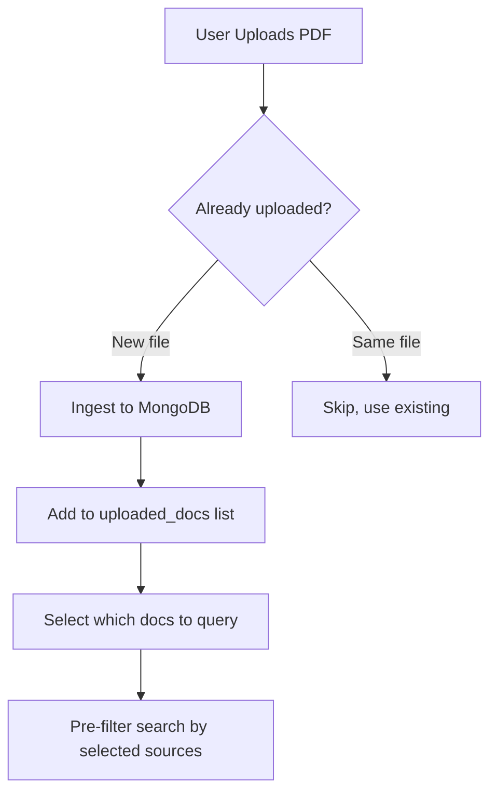

# Fix Document Upload & Multi-Document Support

## Problems Identified

1. **`pdf_ingested` stays True** - Blocks new uploads after first success
2. **Reset doesn't clear document state** - Only clears chat, not current_source/pdf_ingested
3. **X button ignored** - When user removes file, state isn't updated
4. **Rate limiting blocks re-uploads** - Same filename blocked for 4 hours
5. **Single document only** - No multi-document support

## Solution: Document Session Management

---

## Proposed Changes

### 1. Track Uploaded Documents (not just boolean)

**Before**: `pdf_ingested: bool`  
**After**: `uploaded_docs: list[str]` - List of source IDs

### 2. Handle File Removal (X button)

Detect when `uploaded` file object is None but we have documents, offer to clear session.

### 3. Multi-Document Selection

Add checkboxes to select which documents to query.

### 4. Proper Reset

Reset button clears: messages, history, uploaded_docs, current selections.

---

## Files to Modify

#### [MODIFY] [streamlit_app.py](file:///home/syedalijaseem/Projects/DocuRAG-AI-Agent/streamlit_app.py)

- Change `pdf_ingested` bool → `uploaded_docs` list
- Add multi-file upload support
- Add document selection checkboxes
- Fix reset to clear all state
- Handle file removal

#### [MODIFY] [main.py](file:///home/syedalijaseem/Projects/DocuRAG-AI-Agent/main.py)

- Accept list of source_ids for multi-document query

#### [MODIFY] [vector_db.py](file:///home/syedalijaseem/Projects/DocuRAG-AI-Agent/vector_db.py)

- Update filter to accept list of sources (uses `$in` operator)
