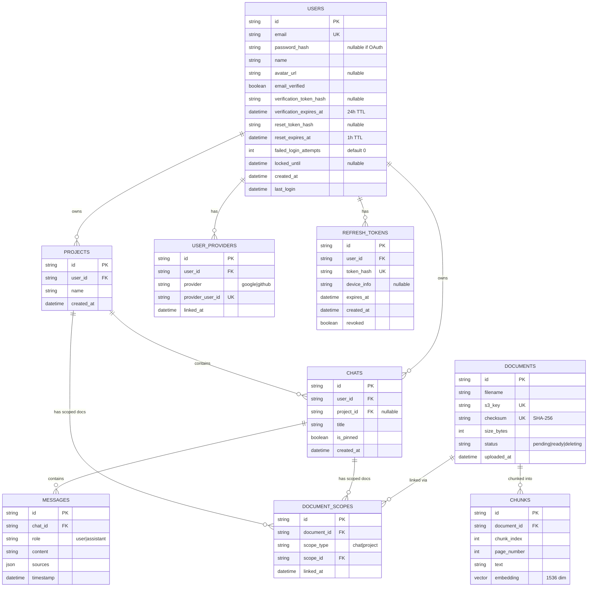

# Scoped Document System - Implementation Plan

## Data Model



### Global Document Store Benefits

- **Deduplication**: Same file → same `document_id` via checksum
- **Reuse**: One doc can link to multiple scopes
- **Clean deletion**: Remove scope link; orphan cleanup removes doc when no links
- **Efficient storage**: Chunks reference doc by ID only

---

## Quality Review

### 1. Security ✅

| Aspect           | Implementation                            |
| ---------------- | ----------------------------------------- |
| Access Control   | `user_id` FK; all queries filter by user  |
| Scope Isolation  | Queries join via `document_scopes`        |
| Input Validation | File type, size, magic bytes; scope check |
| Encryption       | S3 SSE, MongoDB Atlas encryption, TLS     |
| Auth             | JWT RS256, bcrypt, HTTP-only cookies      |
| Audit Logs       | Upload/delete/login events                |

### 2. Scalability ✅

| Aspect             | Implementation                     |
| ------------------ | ---------------------------------- |
| Horizontal Scaling | Stateless FastAPI replicas         |
| Database           | MongoDB Atlas auto-scale           |
| Object Storage     | S3 unlimited                       |
| Ingestion          | Inngest queue + concurrent workers |

### 3. Robustness ✅

| Aspect           | Implementation                     |
| ---------------- | ---------------------------------- |
| Idempotent Ops   | Checksum dedup                     |
| Graceful Failure | Status field, retry logic          |
| Orphan Cleanup   | Background job                     |
| Transactions     | MongoDB transactions for multi-doc |

### 4. Efficiency ✅

| Aspect          | Implementation         |
| --------------- | ---------------------- |
| Storage Dedup   | Checksum-based         |
| No Metadata Dup | Chunks ref doc by ID   |
| Indexed Queries | Indexes on all FKs     |
| Batch Ops       | Bulk upsert for chunks |

### 5. Availability ✅

| Aspect               | Implementation                 |
| -------------------- | ------------------------------ |
| Stateless API        | Any replica handles request    |
| Managed Services     | Atlas, S3 high availability    |
| Async Pipeline       | Inngest handles ingestion      |
| Graceful Degradation | "Pending" status during ingest |

### 6. Speed ✅

| Target            | Value |
| ----------------- | ----- |
| Upload response   | <2s   |
| Query latency     | <20s  |
| Delete visibility | <1s   |
| Ingest (5MB)      | <60s  |

### 7. Optimization ✅

| Aspect            | Implementation                    |
| ----------------- | --------------------------------- |
| Embedding Batch   | Batch API calls                   |
| Pre-filter Search | Filter by scope before similarity |
| Connection Pool   | MongoDB pooling                   |
| Chunk Tuning      | 512 tokens, 128 overlap           |

### 8. Best Practices ✅

| Practice               | Implementation                  |
| ---------------------- | ------------------------------- |
| Single Source of Truth | `documents` table canonical     |
| Separation of Concerns | Metadata vs embeddings vs files |
| Immutable IDs          | UUIDs everywhere                |
| Soft Delete Pattern    | status=deleting → cleanup       |
| Audit Trail            | Timestamped events              |

### 9. Architecture ✅

```
Frontend → FastAPI → Inngest → [MongoDB + S3]
           (Stateless)  (Queue)   (Managed)
```

---

## Milestone 0: User Authentication (4-5 days)

> [!IMPORTANT] > **Prerequisite for all other milestones.**

### Auth Endpoints

| Method | Endpoint                    | Description       |
| ------ | --------------------------- | ----------------- |
| POST   | `/api/auth/register`        | Signup            |
| POST   | `/api/auth/login`           | Login             |
| POST   | `/api/auth/google`          | Google OAuth      |
| GET    | `/api/auth/verify-email`    | Verify link       |
| POST   | `/api/auth/refresh`         | Refresh token     |
| POST   | `/api/auth/logout`          | Logout            |
| POST   | `/api/auth/logout-all`      | Logout everywhere |
| GET    | `/api/auth/me`              | Get user          |
| PATCH  | `/api/auth/email`           | Change email      |
| POST   | `/api/auth/forgot-password` | Request reset     |
| POST   | `/api/auth/reset-password`  | Complete reset    |
| DELETE | `/api/auth/providers/{p}`   | Unlink OAuth      |
| DELETE | `/api/auth/account`         | Delete account    |

### Security Rules

- Password: 8+ chars, 1 upper, 1 number, HaveIBeenPwned check
- Lockout: 5 attempts → 15min
- Rate limit: 100 req/IP/15min, 5 login/email/15min
- Token TTLs: Verification 24h, Reset 1h
- Max sessions: 10/user

### Frontend Pages

- `/login`, `/register`, `/verify-email`, `/forgot-password`, `/reset-password`, `/settings`

### Tasks

- [ ] M0.1: User + Provider + Token models
- [ ] M0.2: Password hashing (bcrypt)
- [ ] M0.3: JWT RS256 tokens
- [ ] M0.4: Register + verify flow
- [ ] M0.5: Login + lockout + refresh
- [ ] M0.6: Google OAuth
- [ ] M0.7: Protected route middleware
- [ ] M0.8: Password reset flow
- [ ] M0.9: Email change flow
- [ ] M0.10: Session management
- [ ] M0.11: Account deletion
- [ ] M0.12-14: Frontend pages
- [ ] M0.15: Email service (Inngest + SendGrid)
- [ ] M0.16: Token cleanup job

---

## M1: Core Data Model & API (2-3 days)

- [ ] Update Document model with status field
- [ ] Create DocumentScope, Chunk models
- [ ] Upload endpoint with scope validation + checksum
- [ ] GET documents by scope
- [ ] DELETE with cascade

## M2: Ingestion Pipeline (2-3 days)

- [ ] Refactor ingest to create Chunk records
- [ ] File validation (type, size)
- [ ] Progress tracking via status
- [ ] Deterministic chunking

## M3: Query & Retrieval (1-2 days)

- [ ] Vector search with scope filter
- [ ] Project-inherited search (chat + project docs)
- [ ] Target <20s response

## M4: Frontend Chat Upload (2 days)

- [ ] Upload in message composer
- [ ] Progress indicator
- [ ] Document list in sidebar
- [ ] "Upload to start" CTA

## M5: Frontend Project Upload (2 days)

- [ ] Project view with upload area
- [ ] Project dropdown selector
- [ ] Chat list within project

## M6: Deletion & Cleanup (1-2 days)

- [ ] Immediate hide (status=deleting)
- [ ] Background cleanup job (S3 + Chunks)
- [ ] Cascade: chat→docs, project→chats+docs

## M7: Observability & Testing (1-2 days)

- [ ] Timing logs for pipeline stages
- [ ] Acceptance test suite
- [ ] Load test for targets

**Total: M0 (4-5d) + M1-7 (11-16d) = 15-21 days**

---

## Acceptance Tests

| ID              | Test                     | Pass Criteria            |
| --------------- | ------------------------ | ------------------------ |
| **Auth**        |
| A1              | Register valid           | User created, email sent |
| A2              | Login verified           | JWT issued               |
| A3              | 5 failed logins          | Locked 15min             |
| A4              | Google OAuth new         | User + provider created  |
| A5              | Delete account           | Data removed             |
| **Visibility**  |
| V1              | Upload to chat A         | Visible only in A        |
| V2              | Upload to project P      | Visible in all P chats   |
| V3              | Access chat A doc from B | Forbidden                |
| **Deletion**    |
| D1              | Delete chat              | Docs removed             |
| D2              | Delete project           | Chats + docs removed     |
| D3              | Orphan cleanup           | Cleaned <5min            |
| **Performance** |
| P1              | Upload 5MB               | Ingest <60s              |
| P2              | Query 10 docs            | Response <20s            |
| **Security**    |
| S1              | Upload non-PDF           | Rejected 400             |
| S2              | Upload >50MB             | Rejected 400             |

---

## Success Metrics

| Metric              | Target |
| ------------------- | ------ |
| Query latency (p95) | <20s   |
| Ingest (5MB)        | <60s   |
| Delete visibility   | <1s    |
| Orphan cleanup      | <5min  |
| Login response      | <500ms |

---

## Rollout

### Stage 1: Dev

- Deploy, run test suite, fix blockers

### Stage 2: Staging

- Production-like data, manual tests, load test

### Stage 3: Production

- Feature flag, monitor, rollback if >25% errors or p95 >30s

### Data Migration

- Existing docs: backfill status=ready
- Existing embeddings: have scope info already
- Legacy chat_sessions: remove after verification

---

## Tech Stack

| Layer              | Technology                           | Notes                              |
| ------------------ | ------------------------------------ | ---------------------------------- |
| **Frontend**       | React 19 + Vite                      | TypeScript, Tailwind CSS           |
| **Backend**        | FastAPI + Python 3.12                | Async, type hints, Pydantic v2     |
| **Auth**           | python-jose (JWT) + passlib (bcrypt) | RS256 asymmetric signing           |
| **OAuth**          | Google Identity Services             | @react-oauth/google for frontend   |
| **Database**       | MongoDB Atlas                        | M0 free tier → M10+ for production |
| **Vector Store**   | MongoDB Atlas Vector Search          | 1536-dim embeddings                |
| **Object Storage** | AWS S3                               | SSE-S3 encryption                  |
| **Queue**          | Inngest                              | Async ingestion, email sending     |
| **Email**          | SendGrid or AWS SES                  | Transactional emails               |
| **Embeddings**     | OpenAI text-embedding-3-small        | 1536 dimensions                    |
| **LLM**            | OpenAI GPT-4o                        | RAG response generation            |

---

## Detailed Auth Flows

### Email Registration Flow

```
┌─────────┐     ┌─────────┐     ┌─────────┐     ┌─────────┐
│ Frontend│────▶│ FastAPI │────▶│ MongoDB │     │ Inngest │
└────┬────┘     └────┬────┘     └─────────┘     └────┬────┘
     │               │                               │
     │ POST /register│                               │
     │ {email,pass,  │                               │
     │  name}        │                               │
     │───────────────▶                               │
     │               │ Validate password rules       │
     │               │ Check email not exists        │
     │               │ Hash password (bcrypt)        │
     │               │ Generate verification token   │
     │               │ Create user (verified=false)  │
     │               │──────────────▶                │
     │               │               │               │
     │               │ Queue email   │               │
     │               │───────────────────────────────▶
     │               │                               │ Send verification
     │◀──────────────│                               │ email
     │ 201 Created   │                               │
     │ "Check email" │                               │
```

### Login Flow with Lockout

```
POST /api/auth/login {email, password}
    │
    ▼
┌───────────────────┐
│ Find user by email│──▶ Not found? Return generic 401
└─────────┬─────────┘
          ▼
┌───────────────────┐
│ Check locked_until│──▶ Still locked? Return 423 Locked
└─────────┬─────────┘
          ▼
┌───────────────────┐
│ Verify password   │──▶ Wrong? Increment attempts
└─────────┬─────────┘         │
          │                   ▼
          │            ┌──────────────┐
          │            │ attempts >= 5│──▶ Set locked_until
          │            └──────────────┘
          ▼
┌───────────────────┐
│ Check verified    │──▶ Not verified? Return 403
└─────────┬─────────┘
          ▼
┌───────────────────┐
│ Reset attempts=0  │
│ Generate JWT      │
│ Generate refresh  │
│ Set HTTP-only     │
│ cookies           │
└───────────────────┘
```

---

## API Request/Response Contracts

### Auth Endpoints

```typescript
// POST /api/auth/register
Request: { email: string, password: string, name: string }
Response: { message: "Verification email sent" }
Errors: 400 (validation), 409 (email exists)

// POST /api/auth/login
Request: { email: string, password: string }
Response: { user: User }
Cookies: access_token (15min), refresh_token (7d)
Errors: 401 (invalid), 403 (unverified), 423 (locked)

// POST /api/auth/google
Request: { id_token: string }
Response: { user: User, is_new: boolean }
Cookies: access_token, refresh_token

// GET /api/auth/me
Headers: Cookie (access_token)
Response: { user: User, providers: string[] }
Errors: 401 (unauthorized)
```

### Document Endpoints

```typescript
// POST /api/upload?scope_type=chat&scope_id={id}
Request: multipart/form-data { file: PDF }
Response: { document_id, filename, status: "pending" }
Errors: 400 (invalid file), 404 (scope not found), 413 (too large)

// GET /api/chats/{id}/documents?include_project=true
Response: { documents: Document[], project_documents?: Document[] }

// DELETE /api/documents/{id}
Response: { status: "deleted" }
Side effects: S3 file, chunks, scope links removed
```

---

## MongoDB Indexes

```javascript
// users collection
db.users.createIndex({ email: 1 }, { unique: true });
db.users.createIndex({ verification_token_hash: 1 }, { sparse: true });
db.users.createIndex({ reset_token_hash: 1 }, { sparse: true });

// user_providers collection
db.user_providers.createIndex({ user_id: 1 });
db.user_providers.createIndex(
  { provider: 1, provider_user_id: 1 },
  { unique: true }
);

// refresh_tokens collection
db.refresh_tokens.createIndex({ user_id: 1 });
db.refresh_tokens.createIndex({ token_hash: 1 }, { unique: true });
db.refresh_tokens.createIndex({ expires_at: 1 }, { expireAfterSeconds: 0 });

// documents collection
db.documents.createIndex({ checksum: 1 }, { unique: true });
db.documents.createIndex({ s3_key: 1 }, { unique: true });
db.documents.createIndex({ status: 1 });

// document_scopes collection
db.document_scopes.createIndex({ document_id: 1 });
db.document_scopes.createIndex({ scope_type: 1, scope_id: 1 });

// chunks collection (with vector search)
db.chunks.createIndex({ document_id: 1 });
// Vector search index created in Atlas UI:
// { "type": "vectorSearch", "fields": [{"path": "embedding", "numDimensions": 1536, "similarity": "cosine"}] }

// projects, chats, messages
db.projects.createIndex({ user_id: 1 });
db.chats.createIndex({ user_id: 1 });
db.chats.createIndex({ project_id: 1 });
db.messages.createIndex({ chat_id: 1 });
```

---

## Environment Variables

```bash
# Auth
JWT_PRIVATE_KEY=         # RS256 private key (PEM)
JWT_PUBLIC_KEY=          # RS256 public key (PEM)
JWT_ALGORITHM=RS256
ACCESS_TOKEN_EXPIRE_MINUTES=15
REFRESH_TOKEN_EXPIRE_DAYS=7

# Google OAuth
GOOGLE_CLIENT_ID=
GOOGLE_CLIENT_SECRET=

# Database
MONGODB_URI=

# Storage
AWS_ACCESS_KEY_ID=
AWS_SECRET_ACCESS_KEY=
AWS_S3_BUCKET=
AWS_REGION=us-east-2

# Email
SENDGRID_API_KEY=        # or SES credentials
FROM_EMAIL=noreply@docurag.com

# AI
OPENAI_API_KEY=

# App
FRONTEND_URL=http://localhost:5173
BACKEND_URL=http://localhost:8000
```

---

## Dependencies to Add

```toml
# pyproject.toml additions
[project.dependencies]
python-jose = { extras = ["cryptography"], version = "^3.3" }
passlib = { extras = ["bcrypt"], version = "^1.7" }
google-auth = "^2.0"
sendgrid = "^6.0"      # or boto3 for SES
```

```json
// package.json additions
{
  "dependencies": {
    "@react-oauth/google": "^0.12",
    "react-router-dom": "^7.0"
  }
}
```

---

## Future Roadmap (Post-MVP)

| Feature                    | Priority | Effort   |
| -------------------------- | -------- | -------- |
| 2FA/MFA (TOTP)             | High     | 2-3 days |
| Magic link login           | Medium   | 1 day    |
| GitHub OAuth               | Medium   | 0.5 day  |
| Microsoft OAuth            | Low      | 0.5 day  |
| SSO/SAML                   | Low      | 3-5 days |
| Document sharing links     | Medium   | 2 days   |
| Team workspaces            | High     | 5-7 days |
| Soft delete (30-day trash) | Medium   | 1-2 days |
| Export data (GDPR)         | High     | 1 day    |
