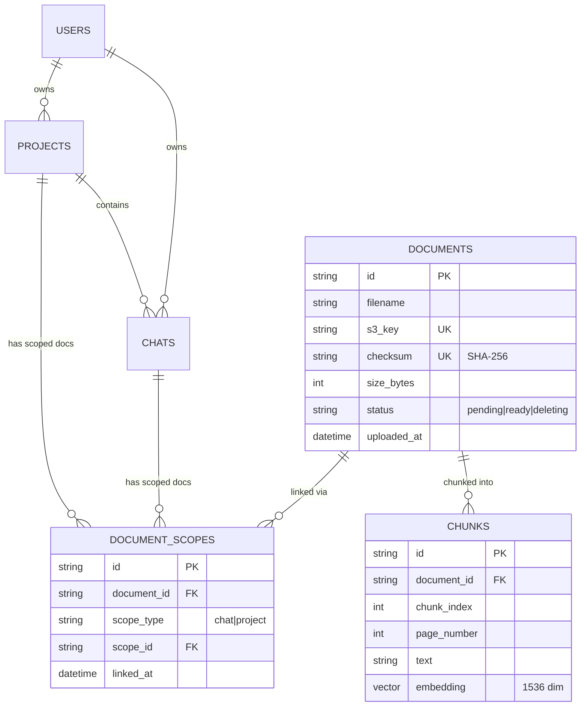

# M1: Core Data Model & API - Requirements Specification

## Overview

Milestone 1 establishes the core data model for the scoped document system. This includes the Document, DocumentScope, and Chunk models, along with the API endpoints for document CRUD operations. The goal is to enable documents to be uploaded to specific scopes (chat or project) with proper isolation, deduplication via checksums, and efficient storage.

**Estimated Duration:** 2-3 days

**Dependencies:**

- M0: User Authentication (complete) - required for user ownership validation

---

## ER Diagram Context



### Key Relationships

| Relationship             | Cardinality | Description                                   |
| ------------------------ | ----------- | --------------------------------------------- |
| Document → DocumentScope | 1:N         | One document can be linked to multiple scopes |
| Document → Chunk         | 1:N         | One document is split into multiple chunks    |
| Chat → DocumentScope     | 1:N         | One chat can have multiple document links     |
| Project → DocumentScope  | 1:N         | One project can have multiple document links  |
| User → Chat              | 1:N         | User owns chats (via chat.user_id)            |
| User → Project           | 1:N         | User owns projects (via project.user_id)      |

### Design Decisions

1. **Global Document Store**: Documents are stored once, linked many times via DocumentScope
2. **Checksum Deduplication**: Same file content → same document_id
3. **Soft Delete Pattern**: `status: "deleting"` → background cleanup
4. **Scope Isolation**: All queries filter by scope, never expose cross-user documents

---

## Functional Requirements

### FR-1: Document Model with Status Field

**Description:** Update the Document model to include a `status` field that tracks the document lifecycle.

**Status Values:**
| Status | Meaning |
|--------|---------|
| `pending` | Uploaded, ingestion in progress |
| `ready` | Fully ingested, searchable |
| `deleting` | Marked for deletion, hidden from queries |

**Acceptance Criteria:**

- [ ] Document model has `status` field with enum validation
- [ ] Default status is `pending` on upload
- [ ] Status transitions: `pending` → `ready` (after ingest) or `pending` → `deleting`
- [ ] `ready` → `deleting` on delete request
- [ ] Queries exclude `deleting` documents unless explicitly requested

---

### FR-2: DocumentScope Junction Model

**Description:** Create the DocumentScope model that links documents to their scopes (chat or project).

**Fields:**

- `id`: Unique identifier (UUID)
- `document_id`: FK to Document
- `scope_type`: Enum ("chat" | "project")
- `scope_id`: ID of the chat or project
- `linked_at`: Timestamp of link creation

**Acceptance Criteria:**

- [ ] DocumentScope model defined with all fields
- [ ] Compound index on (scope_type, scope_id) for efficient queries
- [ ] Index on document_id for cascade deletes
- [ ] Validation: scope_type must be "chat" or "project"
- [ ] Validation: scope_id must exist in corresponding collection

---

### FR-3: Chunk Model

**Description:** Create the Chunk model for storing document chunks with embeddings.

**Fields:**

- `id`: Unique identifier (UUID)
- `document_id`: FK to Document
- `chunk_index`: Sequential index within document
- `page_number`: Source page in original document
- `text`: Chunk text content
- `embedding`: 1536-dimension vector

**Acceptance Criteria:**

- [ ] Chunk model defined with all fields
- [ ] Index on document_id for batch operations
- [ ] Vector search index configured in MongoDB Atlas
- [ ] Chunks reference document by ID only (no metadata duplication)

---

### FR-4: Upload Endpoint with Scope Validation

**Description:** Create `POST /api/upload` endpoint for uploading documents to a scope.

**Request:**

```http
POST /api/upload?scope_type=chat&scope_id={id}
Content-Type: multipart/form-data
Cookie: access_token

file: [PDF binary]
```

**Response (201 Created):**

```json
{
  "document_id": "doc_abc123",
  "filename": "research_paper.pdf",
  "size_bytes": 1048576,
  "status": "pending",
  "checksum": "sha256:..."
}
```

**Behavior:**

1. Validate user authentication
2. Validate scope exists and belongs to user
3. Calculate SHA-256 checksum of file
4. Check if document with same checksum exists
   - If exists: Link existing document to new scope (reuse)
   - If not: Upload to S3, create Document record
5. Create DocumentScope link
6. Queue ingestion job via Inngest
7. Return document metadata

**Acceptance Criteria:**

- [ ] Endpoint accepts multipart/form-data
- [ ] Validates scope_type is "chat" or "project"
- [ ] Validates scope_id exists and belongs to authenticated user
- [ ] Calculates SHA-256 checksum before upload
- [ ] Reuses existing document if checksum matches
- [ ] Creates DocumentScope link regardless of reuse
- [ ] Returns 201 with document metadata
- [ ] Queues ingestion job for new documents
- [ ] Returns 400 for invalid file type (non-PDF)
- [ ] Returns 413 for files > 50MB
- [ ] Returns 404 for non-existent scope

---

### FR-5: Get Documents by Scope

**Description:** Create `GET /api/documents` endpoint to retrieve documents for a scope.

**Request:**

```http
GET /api/chats/{chat_id}/documents?include_project=true
Cookie: access_token
```

**Response (200 OK):**

```json
{
  "documents": [
    {
      "id": "doc_abc123",
      "filename": "research_paper.pdf",
      "size_bytes": 1048576,
      "status": "ready",
      "uploaded_at": "2025-12-10T01:00:00Z"
    }
  ],
  "project_documents": [
    {
      "id": "doc_xyz789",
      "filename": "project_data.pdf",
      "size_bytes": 2097152,
      "status": "ready",
      "uploaded_at": "2025-12-09T12:00:00Z"
    }
  ]
}
```

**Behavior:**

1. Validate user owns the chat
2. Query DocumentScope where scope_type="chat" and scope_id=chat_id
3. Join to Documents where status != "deleting"
4. If `include_project=true` and chat has project_id:
   - Also query DocumentScope where scope_type="project" and scope_id=project_id
   - Return as separate `project_documents` array

**Acceptance Criteria:**

- [ ] Endpoint returns documents for a specific chat
- [ ] Excludes documents with status="deleting"
- [ ] Optionally includes project-level documents
- [ ] Returns 404 for non-existent chat
- [ ] Returns 403 for chat not owned by user
- [ ] Project-level endpoint: `GET /api/projects/{project_id}/documents`

---

### FR-6: Delete Document with Cascade

**Description:** Create `DELETE /api/documents/{id}` endpoint to remove a document.

**Request:**

```http
DELETE /api/documents/{document_id}?scope_type=chat&scope_id={id}
Cookie: access_token
```

**Response (200 OK):**

```json
{
  "status": "deleted",
  "message": "Document unlinked from scope"
}
```

**Behavior - Unlink from Scope:**

1. Validate user owns the scope
2. Remove DocumentScope link for specified scope
3. Check if document has any remaining scope links
4. If no links remain:
   - Set Document status to "deleting"
   - Queue cleanup job (delete S3 file + Chunks)
5. If links remain: Document stays available in other scopes

**Behavior - Delete Document Entirely:**

```http
DELETE /api/documents/{document_id}
Cookie: access_token
```

1. Remove ALL DocumentScope links for scopes owned by user
2. If document becomes orphaned, trigger cleanup

**Acceptance Criteria:**

- [ ] Unlinks document from specified scope
- [ ] Sets status="deleting" if no remaining links
- [ ] Queues background cleanup job for orphans
- [ ] Does not delete chunks/S3 synchronously (eventual consistency)
- [ ] Returns 404 for non-existent document
- [ ] Returns 403 for document not linked to user's scopes

---

## Non-Functional Requirements

### NFR-1: Security - Access Control

**Category:** Security

**Description:** All document operations must validate user ownership through scope relationships.

**Implementation:**

- Document access is granted via DocumentScope → Scope → User chain
- No direct document access without scope context
- User can only see documents linked to their chats/projects

**Metric:**

- 0 unauthorized access incidents
- All document queries include user filter

---

### NFR-2: Security - Input Validation

**Category:** Security

**Description:** Validate all file uploads and inputs to prevent malicious content.

**Implementation:**

- File type validation: PDF only (check magic bytes, not just extension)
- File size limit: 50MB maximum
- Filename sanitization: Remove special characters
- Scope validation: scope_id must exist and belong to user

**Metric:**

- Reject 100% of non-PDF files
- Reject 100% of files > 50MB

---

### NFR-3: Performance - Upload Response Time

**Category:** Performance

**Description:** Document upload must complete quickly, with ingestion happening asynchronously.

**Implementation:**

- Synchronous: Validate, upload to S3, create Document/Scope records
- Asynchronous: Chunking, embedding, indexing (via Inngest)

**Metric:**

- Upload response: < 2 seconds for 5MB file
- User sees document in "pending" state immediately

---

### NFR-4: Performance - Query Response Time

**Category:** Performance

**Description:** Document listing must be fast.

**Implementation:**

- Indexes on scope_type, scope_id
- Index on document_id in DocumentScope
- Status filter to exclude "deleting"

**Metric:**

- GET documents: < 200ms for 100 documents

---

### NFR-5: Reliability - Checksum Deduplication

**Category:** Reliability

**Description:** Same file content should not create duplicate storage.

**Implementation:**

- SHA-256 checksum calculated before upload
- Unique index on checksum field
- Reuse existing document, create new scope link

**Metric:**

- 100% deduplication for identical files
- Storage savings measurable in production

---

### NFR-6: Robustness - Error Handling

**Category:** Robustness

**Description:** All endpoints must handle errors gracefully with clear messages.

**Implementation:**

- Custom exception handlers for common errors
- Consistent error response format
- Logging of all errors with request context

**Error Response Format:**

```json
{
  "error": true,
  "detail": "Human-readable error message",
  "code": "ERROR_CODE"
}
```

**Metric:**

- No 500 errors from validation failures
- All errors have actionable messages

---

### NFR-7: Scalability - Horizontal Scaling

**Category:** Scalability

**Description:** API should support multiple replicas without shared state.

**Implementation:**

- No in-memory state between requests
- All state in MongoDB/S3
- Connection pooling for database

**Metric:**

- API can run as N replicas behind load balancer

---

### NFR-8: Maintainability - Code Quality

**Category:** Maintainability

**Description:** Code should be well-documented and follow project conventions.

**Implementation:**

- Pydantic models with field descriptions
- Docstrings on all public functions
- Type hints throughout
- Unit tests for all models and endpoints

**Metric:**

- 80%+ test coverage for new code
- All functions have docstrings

---

## API Endpoints Summary

| Method | Endpoint                                    | Description              |
| ------ | ------------------------------------------- | ------------------------ |
| POST   | `/api/upload?scope_type=&scope_id=`         | Upload document to scope |
| GET    | `/api/chats/{id}/documents`                 | Get chat documents       |
| GET    | `/api/projects/{id}/documents`              | Get project documents    |
| DELETE | `/api/documents/{id}?scope_type=&scope_id=` | Unlink from scope        |
| DELETE | `/api/documents/{id}`                       | Delete entirely          |

---

## MongoDB Indexes (New)

```javascript
// documents collection
db.documents.createIndex({ checksum: 1 }, { unique: true });
db.documents.createIndex({ s3_key: 1 }, { unique: true });
db.documents.createIndex({ status: 1 });

// document_scopes collection
db.document_scopes.createIndex({ document_id: 1 });
db.document_scopes.createIndex({ scope_type: 1, scope_id: 1 });
db.document_scopes.createIndex(
  { document_id: 1, scope_type: 1, scope_id: 1 },
  { unique: true }
);

// chunks collection
db.chunks.createIndex({ document_id: 1 });
```

---

## Acceptance Tests

| ID     | Test                         | Pass Criteria                                             |
| ------ | ---------------------------- | --------------------------------------------------------- |
| M1-T1  | Upload PDF to chat           | Document created with status="pending"                    |
| M1-T2  | Upload same PDF again        | Reuses document_id, new scope link                        |
| M1-T3  | Get chat documents           | Returns documents linked to chat                          |
| M1-T4  | Get with include_project     | Returns chat + project documents                          |
| M1-T5  | Delete from chat             | Removes scope link, status unchanged if other links exist |
| M1-T6  | Delete orphan document       | Status set to "deleting"                                  |
| M1-T7  | Access other user's document | Returns 403 Forbidden                                     |
| M1-T8  | Upload non-PDF               | Returns 400 Bad Request                                   |
| M1-T9  | Upload > 50MB                | Returns 413 Payload Too Large                             |
| M1-T10 | Upload to non-existent chat  | Returns 404 Not Found                                     |
