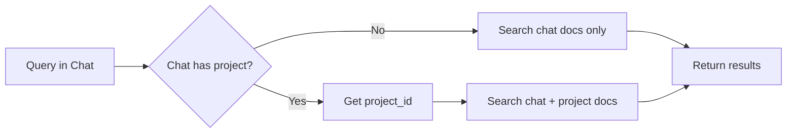

# M3: Query Integration - Development Walkthrough

## Overview

M3 added project-inherited search to enable chat queries to include documents uploaded to the parent project.

**Duration:** December 10, 2025  
**Branch:** `feature/m3-query-integration`

---

## What Was Implemented

### Project-Inherited Search

When a chat belongs to a project, queries now search:

1. Documents uploaded directly to the chat
2. Documents uploaded to the parent project

```python
# In rag_query_pdf_ai
if chat belongs to project:
    project_id = lookup chat's project_id
    search_for_scope(..., include_project=True, project_id=project_id)
```

---

## Key Changes

| File                              | Change                                 |
| --------------------------------- | -------------------------------------- |
| `main.py`                         | Added project_id lookup in `_search()` |
| `tests/test_query_integration.py` | NEW - 6 tests                          |

---

## Test Results: 293 Passed ✅

| Test Suite         | Tests |
| ------------------ | ----- |
| Auth (M0)          | 50    |
| Document (M1)      | 70    |
| Ingestion (M2)     | 35    |
| Query (M3)         | 6     |
| Availability/Speed | 11    |
| API Routes         | 20    |
| Other              | 101   |

---

## How It Works



---

## Next Steps

- **M4**: Frontend Chat Upload UI
- **M5**: Frontend Project Upload UI
