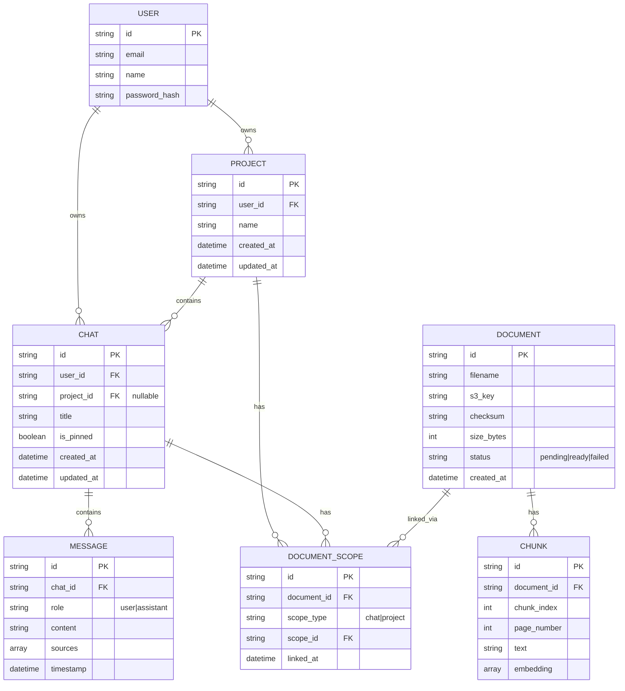
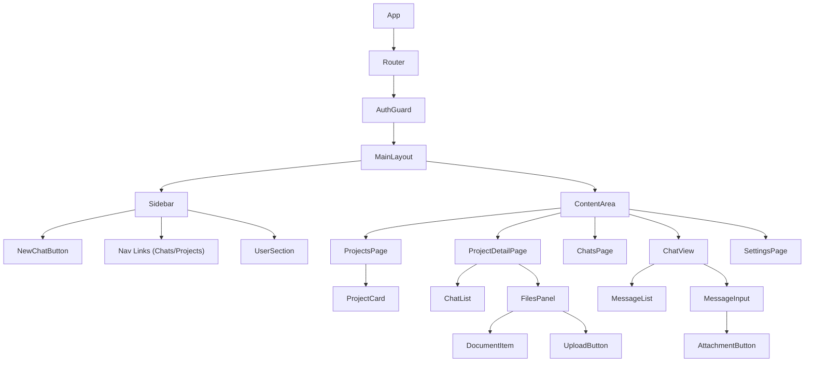

# M4-M5: Frontend Requirements & Design

## Overview

Complete redesign of the DocuRAG frontend to provide a Claude.ai-inspired interface with proper separation of Projects, Chats, and Documents.

---

## User Interface Requirements

### UR-1: Collapsible Sidebar

**Description:** A sidebar that can collapse to icons-only mode or fully hide.

**Behavior:**

- Default: Open on desktop, hidden on mobile
- Toggle: Ctrl+B keyboard shortcut
- When collapsed: Show hamburger menu button in header
- Smooth slide animation (300ms)

```
┌─────────────────────────────────────────────────────┐
│ ☰ DocuRAG                        (when collapsed)   │
├─────────────────────────────────────────────────────┤
│                                                     │
│              [Main Content Area]                    │
│                                                     │
└─────────────────────────────────────────────────────┘

┌────────────┬────────────────────────────────────────┐
│ DocuRAG  X │                                        │
├────────────┤                                        │
│ + New Chat │         [Main Content Area]            │
├────────────┤                                        │
│ 📁 Projects│                                        │
│ 💬 Chats   │                                        │
│ ⚙️ Settings│                                        │
└────────────┴────────────────────────────────────────┘
```

---

### UR-2: Page-Based Navigation

**Pages:**

| Route           | Description                     |
| --------------- | ------------------------------- |
| `/`             | Chats list (default home)       |
| `/projects`     | Projects grid view              |
| `/projects/:id` | Project detail with files panel |
| `/chat/:id`     | Chat conversation view          |
| `/settings`     | Settings page                   |

---

### UR-3: Projects Page (`/projects`)

**Layout:**

```
┌────────────┬────────────────────────────────────────┐
│ Sidebar    │  Projects            [+ New Project]  │
│            ├────────────────────────────────────────┤
│            │  🔍 Search projects...                 │
│            ├────────────────────────────────────────┤
│            │  ┌─────────┐  ┌─────────┐              │
│            │  │Project 1│  │Project 2│              │
│            │  │Updated  │  │Updated  │              │
│            │  └─────────┘  └─────────┘              │
│            │                                        │
└────────────┴────────────────────────────────────────┘
```

**Features:**

- Grid of project cards
- Each card shows: name, updated date, chat count
- Sort by: Activity, Name, Created
- Search/filter projects

---

### UR-4: Project Detail Page (`/projects/:id`)

**Layout:**

```
┌────────────┬─────────────────────────┬──────────────┐
│ Sidebar    │ ← All projects          │ Files      + │
│            │ Project Name            │              │
│            ├─────────────────────────┤ file1.pdf    │
│            │ [Reply input...]     ➤  │ file2.pdf    │
│            ├─────────────────────────┤              │
│            │ Chat 1 in project       │ Instructions │
│            │ Chat 2 in project       │ [Edit...]    │
│            │ Chat 3 in project       │              │
└────────────┴─────────────────────────┴──────────────┘
```

**Features:**

- Left: Project chats list
- Right: Files panel (documents in this project)
- Quick reply input for new chats
- Back navigation to projects list

---

### UR-5: Chats Page (`/` or `/chats`)

**Layout:**

```
┌────────────┬────────────────────────────────────────┐
│ Sidebar    │  Chats                   [+ New Chat]  │
│            ├────────────────────────────────────────┤
│            │  🔍 Search your chats...               │
│            ├────────────────────────────────────────┤
│            │  67 chats                              │
│            │  ─────────────────────────────────────  │
│            │  Chat title 1                          │
│            │  Last message 2 days ago               │
│            │  ─────────────────────────────────────  │
│            │  Chat title 2                          │
│            │  Last message 5 days ago               │
└────────────┴────────────────────────────────────────┘
```

**Features:**

- List of all chats (standalone + project chats)
- Sort by: Last message, Created
- Search chats
- Shows which project each chat belongs to (if any)

---

### UR-6: Chat View (`/chat/:id`)

**Layout:**

```
┌────────────┬────────────────────────────────────────┐
│ Sidebar    │  Chat Title                         ⚙️ │
│            ├────────────────────────────────────────┤
│            │                                        │
│            │  [Messages...]                         │
│            │                                        │
│            ├────────────────────────────────────────┤
│            │  📎 [Type message...]              ➤   │
│            │  Attached: file.pdf (if any)           │
└────────────┴────────────────────────────────────────┘
```

**Features:**

- Message history with sources
- Attachment button (📎) for uploading PDFs
- Settings gear for top_k adjustment
- Shows attached documents for this chat

---

## Entity Relationship Diagram



---

## Component Architecture



---

## State Management

| State          | Scope    | Description                 |
| -------------- | -------- | --------------------------- |
| `user`         | Global   | Current authenticated user  |
| `sidebarOpen`  | Layout   | Sidebar visibility          |
| `currentRoute` | Router   | Current page/view           |
| `projects`     | Projects | List of user's projects     |
| `chats`        | Chats    | List of user's chats        |
| `currentChat`  | ChatView | Active chat data            |
| `messages`     | ChatView | Messages in current chat    |
| `documents`    | Context  | Documents for current scope |

---

## Dark/Light Theme

- Use Tailwind CSS `dark:` variants
- Theme stored in localStorage
- System preference detection
- Toggle in Settings

---

## Responsive Breakpoints

| Breakpoint | Width      | Behavior                       |
| ---------- | ---------- | ------------------------------ |
| Mobile     | < 768px    | Sidebar overlay, single column |
| Tablet     | 768-1024px | Collapsible sidebar            |
| Desktop    | > 1024px   | Persistent sidebar             |

---

## API Endpoints Used

| Endpoint                   | Method           | Description              |
| -------------------------- | ---------------- | ------------------------ |
| `/api/projects`            | GET/POST         | List/create projects     |
| `/api/projects/:id`        | GET/DELETE       | Get/delete project       |
| `/api/chats`               | GET/POST         | List/create chats        |
| `/api/chats/:id`           | GET/PATCH/DELETE | Chat operations          |
| `/api/chats/:id/messages`  | GET              | Get chat messages        |
| `/api/chats/:id/documents` | GET              | Get chat documents       |
| `/api/documents`           | GET              | List documents for scope |
| `/api/upload`              | POST             | Upload document          |
| `/api/events/ingest`       | POST             | Trigger ingestion        |
| `/api/events/query`        | POST             | Send query               |
| `/api/auth/*`              | \*               | Auth endpoints           |
