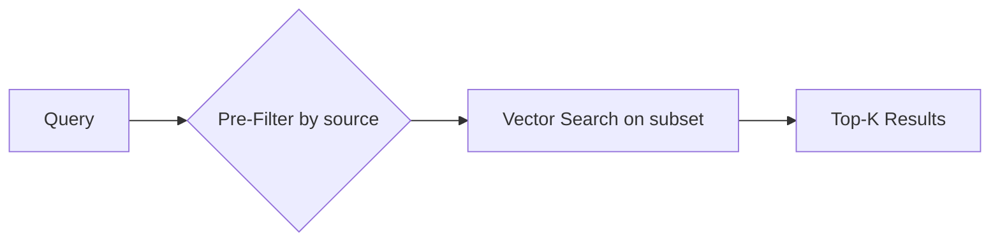

# Migrate Vector Storage from Qdrant to MongoDB Atlas

## Background

The current app uses Qdrant for vector storage, but:

- Qdrant Cloud free tier expires after 3 weeks of inactivity
- Local Qdrant requires running a server or Docker

MongoDB Atlas is a better fit because:

- Free tier (M0, 512MB) never expires
- No local server needed
- Supports vector search via Atlas Search

---

## Solution: Pre-Filtering with MongoDB Atlas Vector Search

MongoDB Atlas Vector Search supports **pre-filtering** which is highly efficient:



### Why Pre-Filtering is Efficient

- **O(1) document lookup**: MongoDB uses indexed `source` field to narrow scope BEFORE vector search
- **Smaller search space**: Only vectors matching the filter are scanned
- **Scalable**: Works with millions of documents

---

## ✅ Completed Changes

### Dependencies

- [pyproject.toml](file:///home/syedalijaseem/Projects/DocuRAG-AI-Agent/pyproject.toml) - replaced qdrant-client with pymongo

### Vector Database Module

- [vector_db.py](file:///home/syedalijaseem/Projects/DocuRAG-AI-Agent/vector_db.py) - complete rewrite for MongoDB Atlas Vector Search
  - `MongoDBStorage` class with upsert/search methods
  - `source_filter` parameter for O(1) document pre-filtering

### Backend

- [main.py](file:///home/syedalijaseem/Projects/DocuRAG-AI-Agent/main.py) - updated to use MongoDBStorage, passes source_id
- [.env.example](file:///home/syedalijaseem/Projects/DocuRAG-AI-Agent/.env.example) - template with MONGODB_URI

### Frontend

- [streamlit_app.py](file:///home/syedalijaseem/Projects/DocuRAG-AI-Agent/streamlit_app.py) - tracks `current_source`, passes to queries

### Atlas Configuration

Vector search index `vector_index` with filter field:

```json
{
  "fields": [
    {
      "type": "vector",
      "path": "embedding",
      "numDimensions": 3072,
      "similarity": "cosine"
    },
    { "type": "filter", "path": "source" }
  ]
}
```
