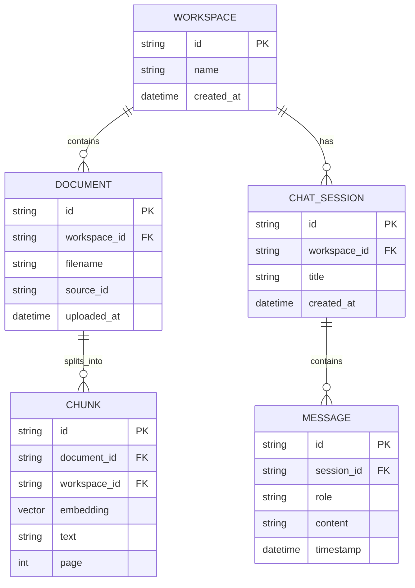

# Workspace & Session Architecture

## Data Model



---

## Key Design Decisions

| Decision          | Choice                  | Rationale                             |
| ----------------- | ----------------------- | ------------------------------------- |
| Document scope    | Workspace-level         | Reuse across chats, single upload     |
| Chat scope        | Session-level           | Independent histories, "New Chat" UX  |
| Vector filter     | `workspace_id`          | All docs in workspace, efficient O(1) |
| State persistence | MongoDB (not Streamlit) | Survives refresh, scalable            |

---

## MongoDB Collections

### `workspaces`

```json
{ "_id": "ws_xxx", "name": "My Project", "created_at": "..." }
```

### `documents` (existing, add workspace_id)

```json
{"doc_id": "...", "workspace_id": "ws_xxx", "embedding": [...], "text": "...", "source": "cv.pdf", "page": 1}
```

### `chat_sessions`

```json
{"_id": "sess_xxx", "workspace_id": "ws_xxx", "title": "Chat 1", "messages": [...]}
```

---

## Implementation

### Phase 1: Backend Data Model

- [ ] Add `workspace_id` to documents on upsert
- [ ] Create `chat_sessions` collection
- [ ] Update vector search to filter by workspace_id

### Phase 2: API Endpoints

- [ ] `POST /workspaces` - create workspace
- [ ] `GET /workspaces/{id}/documents` - list docs
- [ ] `POST /sessions` - create chat session
- [ ] `GET /sessions/{id}/messages` - load history

### Phase 3: Streamlit UI

- [ ] Workspace selector (sidebar)
- [ ] Document list with upload
- [ ] "New Chat" button
- [ ] Session list/switcher
- [ ] Persist session_id in query params

---

## Files to Modify

#### [NEW] models.py

Pydantic models for Workspace, Document, ChatSession, Message

#### [MODIFY] vector_db.py

- Add workspace_id to upsert
- Filter by workspace_id in search

#### [MODIFY] main.py

- Add workspace/session endpoints
- Update ingest to accept workspace_id

#### [MODIFY] streamlit_app.py

- Workspace/session state management
- New Chat functionality
- Document list UI
